<style type="text/css">
div.main-container {
  max-width: 1400px;
  margin-left: auto;
  margin-right: auto;
}
</style>


# The Data

(Almost) every game on boardgamegeek has a description on its profile. These vary in length and tone, but they contain a lot of information to let users know a little about the game. I have previously explored using the BGG API to analyze games using information about game mechanics, categories, complexity, etc, but so far I haven't looked at the description field. What information can we glean from the descriptions?

After some initial cleaning, we have a dataset containing **21842** board games. Most of these have a description field. 


What do these descriptions look like? We can look at a couple of games and their descriptions to get a feel for typical decriptions.

```{=html}
<template id="0a1c09ff-70ba-4dce-bd0a-b3ccb61a964a"><style>
.tabwid table{
  border-spacing:0px !important;
  border-collapse:collapse;
  line-height:1;
  margin-left:auto;
  margin-right:auto;
  border-width: 0;
  display: table;
  margin-top: 1.275em;
  margin-bottom: 1.275em;
  border-color: transparent;
}
.tabwid_left table{
  margin-left:0;
}
.tabwid_right table{
  margin-right:0;
}
.tabwid td {
    padding: 0;
}
.tabwid a {
  text-decoration: none;
}
.tabwid thead {
    background-color: transparent;
}
.tabwid tfoot {
    background-color: transparent;
}
.tabwid table tr {
background-color: transparent;
}
</style><div class="tabwid"><style>.cl-6f8b54b6{}.cl-6f889b72{font-family:'Helvetica';font-size:11pt;font-weight:normal;font-style:normal;text-decoration:none;color:rgba(0, 0, 0, 1.00);background-color:transparent;}.cl-6f88a6b2{margin:0;text-align:left;border-bottom: 0 solid rgba(0, 0, 0, 1.00);border-top: 0 solid rgba(0, 0, 0, 1.00);border-left: 0 solid rgba(0, 0, 0, 1.00);border-right: 0 solid rgba(0, 0, 0, 1.00);padding-bottom:5pt;padding-top:5pt;padding-left:5pt;padding-right:5pt;line-height: 1;background-color:transparent;}.cl-6f88bc6a{width:8714.2pt;background-color:transparent;vertical-align: middle;border-bottom: 1pt solid rgba(102, 102, 102, 1.00);border-top: 0 solid rgba(0, 0, 0, 1.00);border-left: 0 solid rgba(0, 0, 0, 1.00);border-right: 0 solid rgba(0, 0, 0, 1.00);margin-bottom:0;margin-top:0;margin-left:0;margin-right:0;}.cl-6f88bc6b{width:70.7pt;background-color:transparent;vertical-align: middle;border-bottom: 1pt solid rgba(102, 102, 102, 1.00);border-top: 0 solid rgba(0, 0, 0, 1.00);border-left: 0 solid rgba(0, 0, 0, 1.00);border-right: 0 solid rgba(0, 0, 0, 1.00);margin-bottom:0;margin-top:0;margin-left:0;margin-right:0;}.cl-6f88bc74{width:62.7pt;background-color:transparent;vertical-align: middle;border-bottom: 1pt solid rgba(102, 102, 102, 1.00);border-top: 0 solid rgba(0, 0, 0, 1.00);border-left: 0 solid rgba(0, 0, 0, 1.00);border-right: 0 solid rgba(0, 0, 0, 1.00);margin-bottom:0;margin-top:0;margin-left:0;margin-right:0;}.cl-6f88bc75{width:8714.2pt;background-color:transparent;vertical-align: middle;border-bottom: 1pt solid rgba(102, 102, 102, 1.00);border-top: 1pt solid rgba(102, 102, 102, 1.00);border-left: 0 solid rgba(0, 0, 0, 1.00);border-right: 0 solid rgba(0, 0, 0, 1.00);margin-bottom:0;margin-top:0;margin-left:0;margin-right:0;}.cl-6f88bc7e{width:62.7pt;background-color:transparent;vertical-align: middle;border-bottom: 1pt solid rgba(102, 102, 102, 1.00);border-top: 1pt solid rgba(102, 102, 102, 1.00);border-left: 0 solid rgba(0, 0, 0, 1.00);border-right: 0 solid rgba(0, 0, 0, 1.00);margin-bottom:0;margin-top:0;margin-left:0;margin-right:0;}.cl-6f88bc7f{width:70.7pt;background-color:transparent;vertical-align: middle;border-bottom: 1pt solid rgba(102, 102, 102, 1.00);border-top: 1pt solid rgba(102, 102, 102, 1.00);border-left: 0 solid rgba(0, 0, 0, 1.00);border-right: 0 solid rgba(0, 0, 0, 1.00);margin-bottom:0;margin-top:0;margin-left:0;margin-right:0;}.cl-6f88bc80{width:62.7pt;background-color:transparent;vertical-align: middle;border-bottom: 2pt solid rgba(102, 102, 102, 1.00);border-top: 1pt solid rgba(102, 102, 102, 1.00);border-left: 0 solid rgba(0, 0, 0, 1.00);border-right: 0 solid rgba(0, 0, 0, 1.00);margin-bottom:0;margin-top:0;margin-left:0;margin-right:0;}.cl-6f88bc88{width:70.7pt;background-color:transparent;vertical-align: middle;border-bottom: 2pt solid rgba(102, 102, 102, 1.00);border-top: 1pt solid rgba(102, 102, 102, 1.00);border-left: 0 solid rgba(0, 0, 0, 1.00);border-right: 0 solid rgba(0, 0, 0, 1.00);margin-bottom:0;margin-top:0;margin-left:0;margin-right:0;}.cl-6f88bc89{width:8714.2pt;background-color:transparent;vertical-align: middle;border-bottom: 2pt solid rgba(102, 102, 102, 1.00);border-top: 1pt solid rgba(102, 102, 102, 1.00);border-left: 0 solid rgba(0, 0, 0, 1.00);border-right: 0 solid rgba(0, 0, 0, 1.00);margin-bottom:0;margin-top:0;margin-left:0;margin-right:0;}.cl-6f88bc92{width:70.7pt;background-color:transparent;vertical-align: middle;border-bottom: 2pt solid rgba(102, 102, 102, 1.00);border-top: 2pt solid rgba(102, 102, 102, 1.00);border-left: 0 solid rgba(0, 0, 0, 1.00);border-right: 0 solid rgba(0, 0, 0, 1.00);margin-bottom:0;margin-top:0;margin-left:0;margin-right:0;}.cl-6f88bc93{width:8714.2pt;background-color:transparent;vertical-align: middle;border-bottom: 2pt solid rgba(102, 102, 102, 1.00);border-top: 2pt solid rgba(102, 102, 102, 1.00);border-left: 0 solid rgba(0, 0, 0, 1.00);border-right: 0 solid rgba(0, 0, 0, 1.00);margin-bottom:0;margin-top:0;margin-left:0;margin-right:0;}.cl-6f88bc94{width:62.7pt;background-color:transparent;vertical-align: middle;border-bottom: 2pt solid rgba(102, 102, 102, 1.00);border-top: 2pt solid rgba(102, 102, 102, 1.00);border-left: 0 solid rgba(0, 0, 0, 1.00);border-right: 0 solid rgba(0, 0, 0, 1.00);margin-bottom:0;margin-top:0;margin-left:0;margin-right:0;}</style><table class='cl-6f8b54b6'>
```

```{=html}
<thead><tr style="overflow-wrap:break-word;"><td class="cl-6f88bc94"><p class="cl-6f88a6b2"><span class="cl-6f889b72">game_id</span></p></td><td class="cl-6f88bc92"><p class="cl-6f88a6b2"><span class="cl-6f889b72">name</span></p></td><td class="cl-6f88bc93"><p class="cl-6f88a6b2"><span class="cl-6f889b72">description</span></p></td></tr></thead><tbody><tr style="overflow-wrap:break-word;"><td class="cl-6f88bc74"><p class="cl-6f88a6b2"><span class="cl-6f889b72">167355</span></p></td><td class="cl-6f88bc6b"><p class="cl-6f88a6b2"><span class="cl-6f889b72">Nemesis</span></p></td><td class="cl-6f88bc6a"><p class="cl-6f88a6b2"><span class="cl-6f889b72">Playing Nemesis will take you into the heart of sci-fi survival horror in all its terror. A soldier fires blindly down a corridor, trying to stop the alien advance. A scientist races to find a solution in his makeshift lab. A traitor steals the last escape pod in the very last moment. Intruders you meet on the ship are not only reacting to the noise you make but also evolve as the time goes by. The longer the game takes, the stronger they become. During the game, you control one of the crew members with a unique set of skills, personal deck of cards, and individual starting equipment. These heroes cover all your basic SF horror needs. For example, the scientist is great with computers and research, but will have a hard time in combat. The soldier, on the other hand...<br><br>Nemesis is a semi-cooperative game in which you and your crewmates must survive on a ship infested with hostile organisms. To win the game, you have to complete one of the two objectives dealt to you at the start of the game and get back to Earth in one piece. You will find many obstacles on your way: swarms of Intruders (the name given to the alien organisms by the ship AI), the poor physical condition of the ship, agendas held by your fellow players, and sometimes just cruel fate.<br><br>The gameplay of Nemesis is designed to be full of climactic moments which, hopefully, you will find rewarding even when your best plans are ruined and your character meets a terrible fate.<br><br></span></p></td></tr><tr style="overflow-wrap:break-word;"><td class="cl-6f88bc7e"><p class="cl-6f88a6b2"><span class="cl-6f889b72">133473</span></p></td><td class="cl-6f88bc7f"><p class="cl-6f88a6b2"><span class="cl-6f889b72">Sushi Go!</span></p></td><td class="cl-6f88bc75"><p class="cl-6f88a6b2"><span class="cl-6f889b72">In the super-fast sushi card game Sushi Go!, you are eating at a sushi restaurant and trying to grab the best combination of sushi dishes as they whiz by. Score points for collecting the most sushi rolls or making a full set of sashimi. Dip your favorite nigiri in wasabi to triple its value! And once you've eaten it all, finish your meal with all the pudding you've got! But be careful which sushi you allow your friends to take; it might be just what they need to beat you!<br><br>Sushi Go! takes the card-drafting mechanism of Fairy Tale and 7 Wonders and distills it into a twenty-minute game that anyone can play. The dynamics of "draft and pass" are brought to the fore, while keeping the rules to a minimum. As you see the first few hands of cards, you must quickly assess the make-up of the round and decide which type of sushi you'll go for. Then, each turn you'll need to weigh which cards to keep and which to pass on. The different scoring combinations allow for some clever plays and nasty blocks. Round to round, you must also keep your eye on the goal of having the most pudding cards at the end of the game!<br><br></span></p></td></tr><tr style="overflow-wrap:break-word;"><td class="cl-6f88bc80"><p class="cl-6f88a6b2"><span class="cl-6f889b72">124361</span></p></td><td class="cl-6f88bc88"><p class="cl-6f88a6b2"><span class="cl-6f889b72">Concordia</span></p></td><td class="cl-6f88bc89"><p class="cl-6f88a6b2"><span class="cl-6f889b72">Two thousand years ago, the Roman Empire ruled the lands around the Mediterranean Sea. With peace at the borders, harmony inside the provinces, uniform law, and a common currency, the economy thrived and gave rise to mighty Roman dynasties as they expanded throughout the numerous cities. Guide one of these dynasties and send colonists to the remote realms of the Empire; develop your trade network; and appease the ancient gods for their favor — all to gain the chance to emerge victorious!<br><br>Concordia is a peaceful strategy game of economic development in Roman times for 2-5 players aged 13 and up. Instead of looking to the luck of dice or cards, players must rely on their strategic abilities. Be sure to watch your rivals to determine which goals they are pursuing and where you can outpace them! In the game, colonists are sent out from Rome to settle down in cities that produce bricks, food, tools, wine, and cloth. Each player starts with an identical set of playing cards and acquires more cards during the game. These cards serve two purposes:<br><br><br>    They allow a player to choose actions during the game.<br>    They are worth victory points (VPs) at the end of the game. <br><br><br>Concordia is a strategy game that requires advance planning and consideration of your opponent's moves. Every game is different, not only because of the sequence of new cards on sale but also due to the modular layout of cities. (One side of the game board shows the entire Roman Empire with 30 cities for 3-5 players, while the other shows Roman Italy with 25 cities for 2-4 players.) When all cards have been sold or after the first player builds his 15th house, the game ends. The player with the most VPs from the gods (Jupiter, Saturnus, Mercurius, Minerva, Vesta, etc.) wins the game.<br><br></span></p></td></tr></tbody></table></div></template>
<div class="flextable-shadow-host" id="0d97ef5e-8543-412e-8b6c-f5d927c5a242"></div>
<script>
var dest = document.getElementById("0d97ef5e-8543-412e-8b6c-f5d927c5a242");
var template = document.getElementById("0a1c09ff-70ba-4dce-bd0a-b3ccb61a964a");
var caption = template.content.querySelector("caption");
if(caption) {
  caption.style.cssText = "display:block;text-align:center;";
  var newcapt = document.createElement("p");
  newcapt.appendChild(caption)
  dest.parentNode.insertBefore(newcapt, dest.previousSibling);
}
var fantome = dest.attachShadow({mode: 'open'});
var templateContent = template.content;
fantome.appendChild(templateContent);
</script>

```

# Word Frequencies and Description Lengths

In order to make use of the description, we need to do a bit of tidying.

We'll tokenize the description for each game to get a record for each word in the description for every game. We'll remove stop words along the way, as we aren't that interested in the number of times we find words like 'the' or 'and' in descriptions. We'll also take care to remove stop words in other languages (Spanish, German) as well as some other things like numbers (1 player, 2 player, etc).


```r
data(stop_words)

# add in some custom stops
custom_stop_words = stop_words %>%
        bind_rows(.,
                  tibble(word = c(as.character(seq(1, 30))),
                               lexicon = "playercounts"),
                  tibble(word = tm::stopwords("spanish"),
                                          lexicon = "spanish"),
                  tibble(word = tm::stopwords("german"),
                                          lexicon = "german")
        )
                  
                                         
# tidy_descriptions
tidy_tokens = active_game_descriptions %>%
        mutate(description = gsub("[^\u0001-\u007F]+|<U\\+\\w+>","", description)) %>% # remove non ASCII
        select(game_id, name, description) %>%
        unnest_tokens(word, description) %>%
        anti_join(custom_stop_words,
                  by = "word")
```

This will let us start to do some basic analysis of the words we find in game descriptions. For instance, what are the most frequently used words in games?

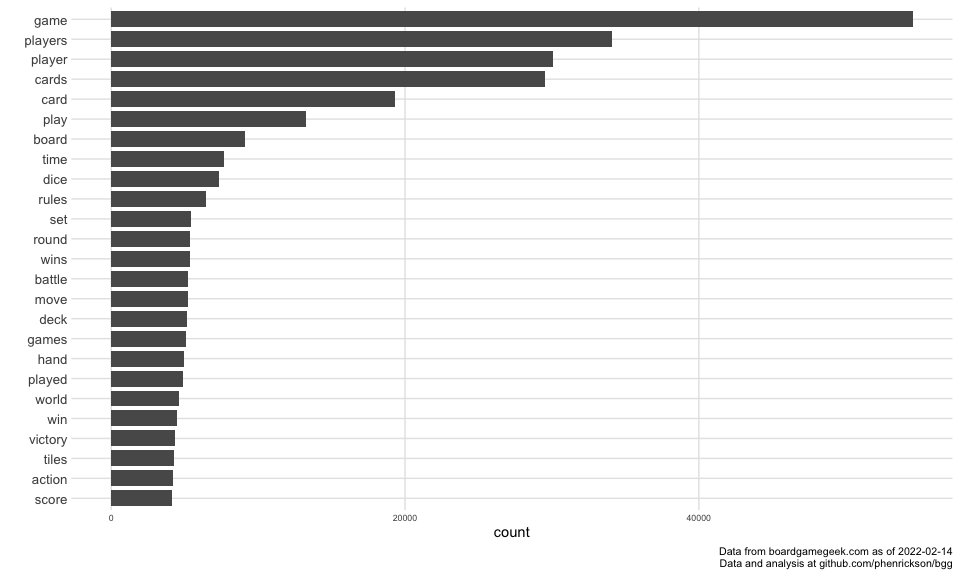

Similarly, how many words do we typically get in a game description? What does the distribution look like?

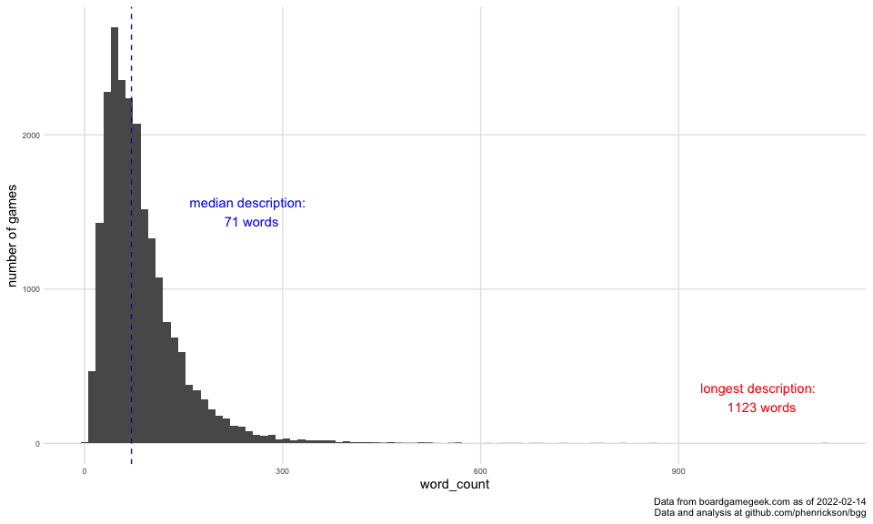

This distribution is pretty right skewed, with some games that have much longer descriptions than the rest. 

## Longest Game Description Prize

Which game has the longest description? **Robinson Crusoe: Escape from Despair Island** takes the prize at a whopping 1123 words (not counting stop words).

Wall of text warning:

```{=html}
<template id="0287ea43-8fc3-4a84-9fca-41ed7887ec1b"><style>
.tabwid table{
  border-spacing:0px !important;
  border-collapse:collapse;
  line-height:1;
  margin-left:auto;
  margin-right:auto;
  border-width: 0;
  display: table;
  margin-top: 1.275em;
  margin-bottom: 1.275em;
  border-color: transparent;
}
.tabwid_left table{
  margin-left:0;
}
.tabwid_right table{
  margin-right:0;
}
.tabwid td {
    padding: 0;
}
.tabwid a {
  text-decoration: none;
}
.tabwid thead {
    background-color: transparent;
}
.tabwid tfoot {
    background-color: transparent;
}
.tabwid table tr {
background-color: transparent;
}
</style><div class="tabwid"><style>.cl-77130512{}.cl-7710a11e{font-family:'Helvetica';font-size:11pt;font-weight:normal;font-style:normal;text-decoration:none;color:rgba(0, 0, 0, 1.00);background-color:transparent;}.cl-7710a74a{margin:0;text-align:left;border-bottom: 0 solid rgba(0, 0, 0, 1.00);border-top: 0 solid rgba(0, 0, 0, 1.00);border-left: 0 solid rgba(0, 0, 0, 1.00);border-right: 0 solid rgba(0, 0, 0, 1.00);padding-bottom:5pt;padding-top:5pt;padding-left:5pt;padding-right:5pt;line-height: 1;background-color:transparent;}.cl-7710b6b8{width:70312.3pt;background-color:transparent;vertical-align: middle;border-bottom: 2pt solid rgba(102, 102, 102, 1.00);border-top: 0 solid rgba(0, 0, 0, 1.00);border-left: 0 solid rgba(0, 0, 0, 1.00);border-right: 0 solid rgba(0, 0, 0, 1.00);margin-bottom:0;margin-top:0;margin-left:0;margin-right:0;}.cl-7710b6c2{width:62.7pt;background-color:transparent;vertical-align: middle;border-bottom: 2pt solid rgba(102, 102, 102, 1.00);border-top: 0 solid rgba(0, 0, 0, 1.00);border-left: 0 solid rgba(0, 0, 0, 1.00);border-right: 0 solid rgba(0, 0, 0, 1.00);margin-bottom:0;margin-top:0;margin-left:0;margin-right:0;}.cl-7710b6c3{width:246.8pt;background-color:transparent;vertical-align: middle;border-bottom: 2pt solid rgba(102, 102, 102, 1.00);border-top: 0 solid rgba(0, 0, 0, 1.00);border-left: 0 solid rgba(0, 0, 0, 1.00);border-right: 0 solid rgba(0, 0, 0, 1.00);margin-bottom:0;margin-top:0;margin-left:0;margin-right:0;}.cl-7710b6cc{width:70312.3pt;background-color:transparent;vertical-align: middle;border-bottom: 2pt solid rgba(102, 102, 102, 1.00);border-top: 2pt solid rgba(102, 102, 102, 1.00);border-left: 0 solid rgba(0, 0, 0, 1.00);border-right: 0 solid rgba(0, 0, 0, 1.00);margin-bottom:0;margin-top:0;margin-left:0;margin-right:0;}.cl-7710b6cd{width:62.7pt;background-color:transparent;vertical-align: middle;border-bottom: 2pt solid rgba(102, 102, 102, 1.00);border-top: 2pt solid rgba(102, 102, 102, 1.00);border-left: 0 solid rgba(0, 0, 0, 1.00);border-right: 0 solid rgba(0, 0, 0, 1.00);margin-bottom:0;margin-top:0;margin-left:0;margin-right:0;}.cl-7710b6d6{width:246.8pt;background-color:transparent;vertical-align: middle;border-bottom: 2pt solid rgba(102, 102, 102, 1.00);border-top: 2pt solid rgba(102, 102, 102, 1.00);border-left: 0 solid rgba(0, 0, 0, 1.00);border-right: 0 solid rgba(0, 0, 0, 1.00);margin-bottom:0;margin-top:0;margin-left:0;margin-right:0;}</style><table class='cl-77130512'>
```

```{=html}
<thead><tr style="overflow-wrap:break-word;"><td class="cl-7710b6cd"><p class="cl-7710a74a"><span class="cl-7710a11e">game_id</span></p></td><td class="cl-7710b6d6"><p class="cl-7710a74a"><span class="cl-7710a11e">name</span></p></td><td class="cl-7710b6cc"><p class="cl-7710a74a"><span class="cl-7710a11e">description</span></p></td></tr></thead><tbody><tr style="overflow-wrap:break-word;"><td class="cl-7710b6c2"><p class="cl-7710a74a"><span class="cl-7710a11e">282389</span></p></td><td class="cl-7710b6c3"><p class="cl-7710a74a"><span class="cl-7710a11e">Robinson Crusoe: Escape from Despair Island</span></p></td><td class="cl-7710b6b8"><p class="cl-7710a74a"><span class="cl-7710a11e">“Never any young adventurer's misfortunes, I believe, began sooner, or continued longer than mine.” <br>― Daniel Defoe, Robinson Crusoe<br><br>Three centuries ago, a singular story perfectly captured the drama of shipwreck and survival, hope and redemption. That story was Robinson Crusoe. Now this timeless tale is brought to life once more in a dynamic card game, but this time you are the one who needs to survive and make it off the island.    <br>This ancient tale it’s alive again!<br><br>In 1651 a young man leaves home for an adventure at sea. He is shipwrecked on an island, 40 miles out to sea. He spends the next 28 years on this island, gathering food, resources, and tools, and battling against insurmountable odds to stay alive. He hunts, raises animals, reads the bible, and begins to turn his focus and attention inward. He becomes a man of God, and learns to accept his fate, growing spiritually. He realizes that he has everything he needs to survive and live in peace.<br><br>Combining themes of hope, strength, and resiliency, this strategic, multi-layered game will test your skills in more ways than one, as you navigate through cannibal attacks, deadly storms, and your own inner turmoil.<br><br>Robinson Crusoe: Escape from Despair Island is a fast-paced, family-friendly game for 1-4 players, ages 14 and up. Offering a new gameplay experience every time, with vibrant art on 160 cards, push-your-luck mechanics, and the age-old theme of survival and escape, it will leave you wondering if you have what it takes to make it home alive.<br><br>Game Play<br> The deck is shuffled, and every player is dealt five cards face down. These cards represent the players’ food supply, with one card being equal to one day's worth of food.<br><br>The game proceeds in a clockwise direction and includes two phases of play during each player’s turn - the exploration phase, and the market phase.<br><br>During exploration phase the active player draws cards from the deck in order to take one card either food card or some camp cards to their camp. Market phase opens for other players once the active player has chosen what card to take.<br><br>Pay every turn<br><br>At the beginning of every turn, a player must discard one food card into the discard pile. This is the cost of playing the game and represents one day's food supply being used up.<br><br>Exploration turn<br><br>During exploration turn, players take turns flipping cards to find the resources they need. You can think of each flipped card as a new resource or ability your character has uncovered. A player can flip up to 10 cards. The aim of the exploration phase is to find food and resources and to build the camp and character. Ultimately the goal is to escape from the island.<br><br>After a maximum of ten cards have been flipped, the active player chooses which card they are going to keep, leaving the remaining cards on the table for the other players to buy.<br><br>There are two ways to take cards from the drawn cards<br><br>1) Harvest food cards i.e cards with a green palm tree symbol on the top left and a food icon on the bottom right. When harvesting, take the indicated amount of food from draw deck and place the food card on the discard pile.<br><br>2) Take camp cards such as construction cards with a brown upper left corner symbol on the top left, character cards with a blue upper left corner symbol, or resource cards with upper left corner left green palm tree corner symbol, other than food cards, to your camp if you meet the requirements.<br><br>The camp can consist of items like a hut, palisade, box or boat, as well as resources such as a rifle, an axe or gunpowder. Character growth and actual character cards are also placed in the camp. When a player builds an item in their camp, the card is placed image side up on the table in front of the player.<br><br>A player can continue flipping cards until either:<br><br>a) they have flipped a total of ten cards, in which case the player is forced to decide what card to take, or <br>b) they decide to stop and take some of the flipped cards to their camp, or alternatively harvest food when the food card is discarded and food cards are taken from the draw deck, or<br>c) they flip a total of two threat cards which from the player cannot defeat the more difficult one.<br><br>Defeat the threats<br><br>If a second threat card is flipped, the player must then defeat the greater of the two threats (denoted by 1, 2, or 3 skulls in the top right corner of the card) if they want to take some flipped card from the table to the camp.<br><br>The threat is defeated by having the cards listed on the card’s "requirement row". Each card has its own symbol. In the above example player have no any cards in the camp, so the exploration turn is over for that player and player do not get to keep any of the cards they have flipped.<br><br>If the player is able to defeat the threat, the card is placed on the discard pile, and they can either continue the exploration phase and drawing cards, or take the indicated amount of food cards and add them to their pile. The options available after defeating the threat are visible on the bottom of the card where there are card deck icon OR food icon with number.<br><br>Build your camp<br><br>When building the camp by taking a construction unit like a boat using an axe and wood, the wood is discarded (it has the finite symbol '1') while axe is not discarded (it has the infinite symbol ∞).<br><br>With every draw you risk encountering threats and losing food, but the one thing you need the most could be waiting under the next card. How far will you go to survive?<br><br>There are many decisions to be made:<br><br>1) Stop flipping cards earlier, and minimize the chance for other players to buy the cards they need during the market phase.<br>2) Keep flipping, and you have a better chance of finding the cards you need, allowing you to gain more food from other players who want to buy these cards from you later. But push your luck too far and you will be defeated by the second threat card, which you cannot defeat. <br>3) Push for consistent development of your resources and character, or grow your food pile first and purchase more helpful cards later?<br>4) Grow your food pile aggressively, and risk losing half of them if a bad luck card shows up. <br>5) Use up your food supplies as you go, and you may find them doubled if a good luck card appears.<br><br>Market phase<br><br>After player has done his exploration turn, the market phase starts. Moving in a clockwise direction, all other players are now given the opportunity to buy any cards that are left from the exploration phase.<br><br>The cost of each card is denoted by a number in the top right corner, which represents the number of food cards the buying player must then discard to acquire the card. On top of this number, the buying player must also give one food card to the selling player.<br><br>If there is no number in the top right corner (as with the goat card) then the buying player does not need to discard any food cards, but they do still need to give the selling player one food card as payment.<br><br>The market phase continues until all the cards have been bought or the players do not want to buy any more. Any cards left on the table at the end of the market phase are then placed in the discard pile.<br><br>Grow your character<br><br>It will take more than just food and shelter to keep player alive. Player will need to teach, pray, and read to build up character, and better the odds of escaping alive. By collecting character growth cards, a player can get characters, which give effects and open up paths to victory.<br><br>Victory paths<br><br>a) Beacon Campfire victory path, either with the Man of God character card or with a camp of 18 victory points <br>b) Escape the Island victory path, either with the Teacher character card or with a camp of 18 victory points <br>c) Victory point strategy, by having the Wise Man character plus 25/20/17 VPs (4/3/2 players)<br><br>Beacon campfire<br><br>You could draw the attention of a rescue ship, but you will need to become a Man of God OR build a camp with at least 18 VPs and find wood and gunpowder to build a fire.<br><br>Escape from the Island<br><br>You can set your sights on building a boat, but you will need to find Friday and teach him how to help you.<br><br>Victory point<br><br>Finally, you can pray and read to become a wise man and build up your victory points to beat the other players.<br><br>Game ends<br><br>The game ends in either of the following situations:<br><br>a) When the draw deck has been played through twice, in which case the player with the most victory points (VPs) wins<br>b) When any player achieves one of the three winning strategies: Beacon Campfire, Escape the Island or Victory points.<br><br>Explanation of card types<br><br>Food cards: There are two kind of food cards, regular food cards and food &amp; resource combo cards, such as wood and goat, that player can use either as a food card (harvested like other food cards) or as a resource card (placed in the camp like regular resource cards). These are necessary in order to maintain an adequate food supply.<br><br>Resource cards: Resource cards have two kinds, regular resources like axe and wood, and food &amp; resource combo cards (see above).<br><br>Construction cards: There are two kinds of construction cards, regular ones and combo ones, combo having two construction units in the same card. These cards are important for protecting yourself and also enabling some victory paths.<br><br>Exploration cards allow a player to take extra cards or double the amount of food collected, which boosts the exploration phase significantly.<br><br>Good &amp; Bad luck cards: Good luck cards give 4 food to the player with the least food cards. Bad luck cards force players with more than 6 food to lose half of their food cards. Both of these cards are enforced as soon as they are drawn.<br><br>Character cards: There are two types of character cards, character growth cards and character cards. Growth ones are important prerequisite cards for the actual character cards, Man of God, and Wise man cards. They are necessary not only for protection, but are also requirements for special victory scenarios.<br><br>The special character card Friday helps to protect the player against many threats. It also allows for an additional card to be drawn when exploring, but it also forces you to pay one more food when you buy.<br><br>Victory cards: Cards like Beacon Campfire and Escape the Island are key victory cards.<br><br>Said about the game<br><br>“If you’re looking for something that re-creates the high drama of it’s subject matter…it does a really great job.”<br><br>– Rahdo<br><br>“The design and the art... I absolutely am in love with. The way the cards are laid out, it makes a lot of sense to me. The art is great, especially for a company that’s just developing.”<br><br>– Board Game Mechanics<br><br>“The packaging is so solid and lovely. Really substantial box. Definitely a game you will be taking around with you.”<br><br>– In the Den<br><br>“Just the right amount of randomness, and the right amount of press-your-luck tension, which I liked the most.”<br><br>― Undead Viking<br><br>“Robinson Crusoe: Escape from Despair Island is a fun, unique blend of mechanics.  At the end of this short game, you feel a sense of accomplishment that you built something great. Overall I really enjoyed this game.”<br><br>― Joel, Boardgame Mechanics<br><br>"The artwork, icons, and mechanics are thematic... it's fun and feels realistic trying to push your luck to get food and items to survive."<br><br>― Meeple University<br><br>“A game full of far more depth than you would suspect.”<br><br>― Nick, Board Game Brawl<br><br>"This is its own beast."<br><br>― Rahdo<br><br>“The packaging is so solid and lovely. Really substantial box. Definitely a game you will be taking around with you.”<br><br>– Gavin In the Den<br><br>“The artwork is just fantastic.. absolutely amazing”<br><br>― Undead Viking<br><br>"A lot of gaming in just a deck of cards, nice artwork and fun to push your luck!"<br><br>― Boardgames With Niramas<br><br>"The game that stays true to its name. If you are in the market for quick deck building with simple easy-to-learn mechanics, and multiple paths to victory, look no further than Robinson Crusoe: Escape from Despair Island."<br><br>- Boardgame Revolution<br><br>The team<br><br>Niko Huttu - Game Design<br><br>Founder of Old Novel Games and the designer of Robinson Crusoe: Escape from Despair Island, Niko loves games (both PC and tabletop) and he is passionate about old novels. But since the birth of his two children, Niko’s relationship with games has changed. His ideas often come to him when he is reading to his children, and that is where the things he is the most passionate about in life come together. He believes every good book deserves to be transformed into a game, and that every avid reader deserves the opportunity to relive their favourite stories.<br><br>Adrian Liza Clares- Art &amp; Illustrations<br><br>Adrian is an astonishing 2D artist who can turn any idea into a stunning piece of 2D art, very quickly. And talk about an honest and humble person!<br><br>"I’m Adrian Liza, a Spanish concept artist based in Gothenburg, Sweden.   During these years, I’ve been developing visual ideas for videogames and recently I had the chance to  be part of the board game “Robinson Crusoe : Escape from Despair Island”, where I was in charge of creating the total visual aspect of the game.  This project was funny and really challenging, because It was nothing like I’ve ever done before. Even so, It was easy to keep up the motivation thanks to Niko Huttu, who made of this production a marvelous experience, that I’ll never forget."<br><br>Pablo - Iconography &amp; Layout Design<br><br>Pablo knows what it takes to be a great card game layout and icon designer. His professionalism is top notch.<br><br>Simon - Video Production &amp; Kickstarter Support<br><br>Simon helped this project take off with his unique ability to envision the end result and bring it to life. His Venezuelan video edition team made the animation film possible. It has been a such a great honor to work with these guys!<br><br>Publisher<br><br>Published by Old Novel Games, a personal project from Niko Huttu.<br><br>Our aim is to encourage more meaningful everyday interactions between friends and family, by providing players with games that combine epic classic novels with rock solid card game strategy. Whether you’re looking for something you can play at your next picnic, after a family dinner, or even with your colleagues during your lunch break, Old Novel Games are fast, straightforward, and easy to learn, making them accessible to everyone.<br><br>“And thus I left the island, the 19th of December, as I found by the ship’s account, in the year 1686, after I had been upon it eight-and-twenty years, two months, and nineteen days;” <br>― Daniel Defoe, Robinson Crusoe<br><br></span></p></td></tr></tbody></table></div></template>
<div class="flextable-shadow-host" id="7283e335-ffc7-4bce-bc28-b2d5b4fc01c4"></div>
<script>
var dest = document.getElementById("7283e335-ffc7-4bce-bc28-b2d5b4fc01c4");
var template = document.getElementById("0287ea43-8fc3-4a84-9fca-41ed7887ec1b");
var caption = template.content.querySelector("caption");
if(caption) {
  caption.style.cssText = "display:block;text-align:center;";
  var newcapt = document.createElement("p");
  newcapt.appendChild(caption)
  dest.parentNode.insertBefore(newcapt, dest.previousSibling);
}
var fantome = dest.attachShadow({mode: 'open'});
var templateContent = template.content;
fantome.appendChild(templateContent);
</script>

```

Oof. That is a doozy. It looks like this isn't *the* Robinson Crusoe, but a recent Kickstarter card game that more or less included its entire rules explanation as well as quotes from prominent reviewers in its description.

## Description Length by Category

I wonder if different types of games have different description lengths, on average? (Note: I did go down a rabbit hole looking at the difference between Kickstarters and non Kickstarter games in word length. Kickstarter games do tend to have slightly longer descriptions, but nothing that interesting emerged.)

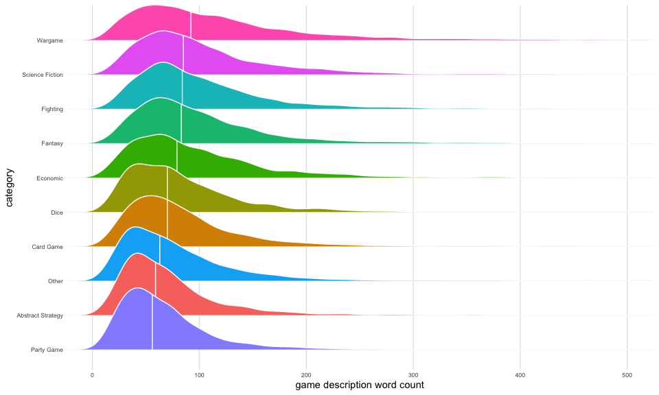

Looks like wargames tend to have the longest descriptions and party games have the shortest. 

## Description Length and Complexity

I wonder if there's a relationship between the word count and the BGG average complexity weight? We'll plot the number of words in the description against the complexity rating. I also usually like to size by the number of user ratings when displaying a BGG rating, as some games will have very few users rating them.

<!-- -->

We do see a bit of a relationship: the length of a game's description explains about 11% of the variation in the complexity rating of the game. The relationship looks to be slightly nonlinear though, with some games at the tails of the distribution on description length that are actually fairly low in complexity.

# Word Frequencies by Category

So far we've just summarized the total number of words, next we can look at the frequencies of specific words within categories

## Word Cloud by Category

We'll make a word cloud for this, because everyone loves word clouds! This will highlight a bit of an issue, though.

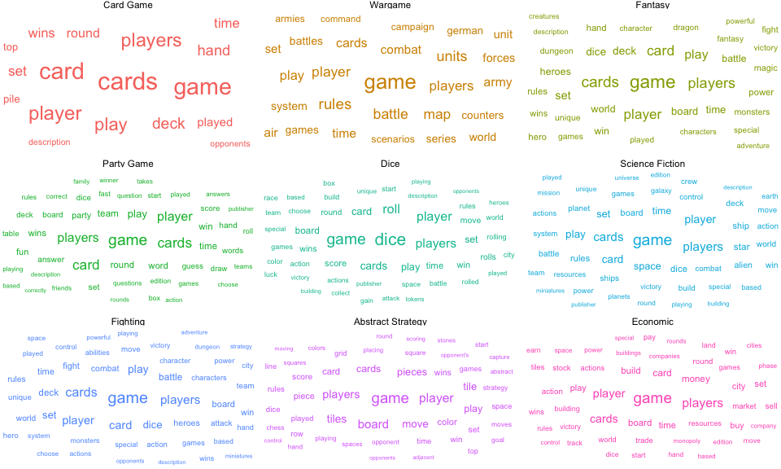

The problem is we tend to find the same types of words in pretty much every category. A few words show up that are unique to each ("army" and "combat" appear in Wargames and Fighting games; "heroes" and "dungeons" show up in Fantasy), but what we'd really like to know is, what are the words that are most distinct to each category?

## tf-idf

What words appear frequently in science fiction games that don't appear frequently in fantasy games? For these types of questions we can compute the *term-frequency inverse document frequency*. This indicates words that are used frequently within a category while not being used frequently within all of the categories.

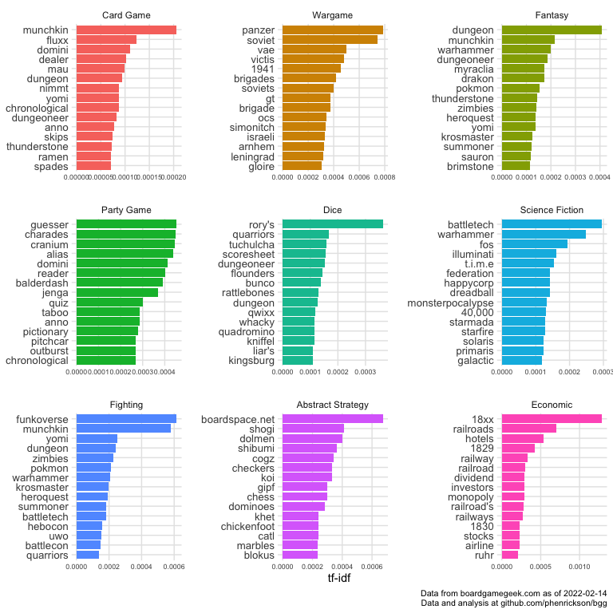

# N-Grams and Word Pairings

What are the most frequent word pairings that show up in game descriptions?

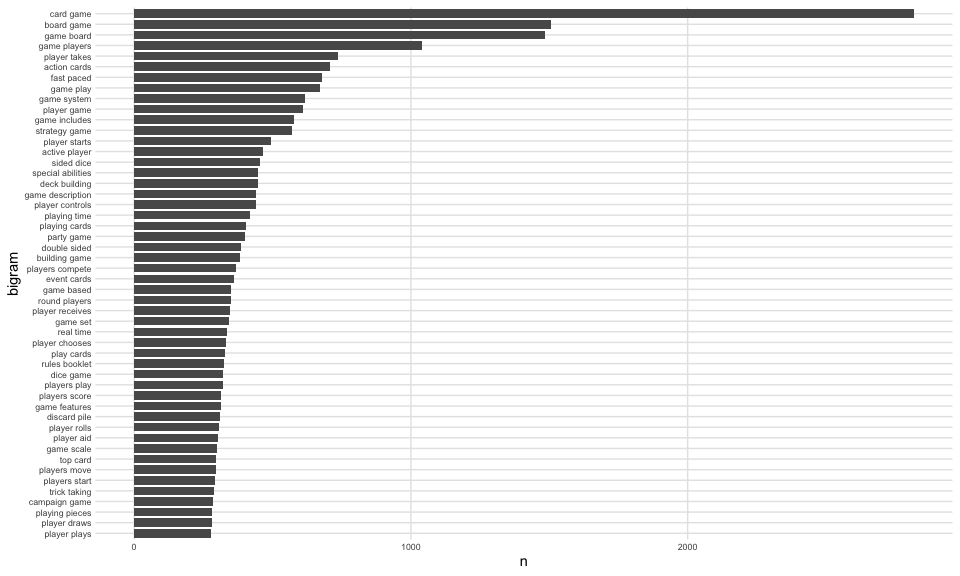<!-- -->


## Word Pairings Network

Another way to investigate word pairings is to create a network of the most frequent word pairings.

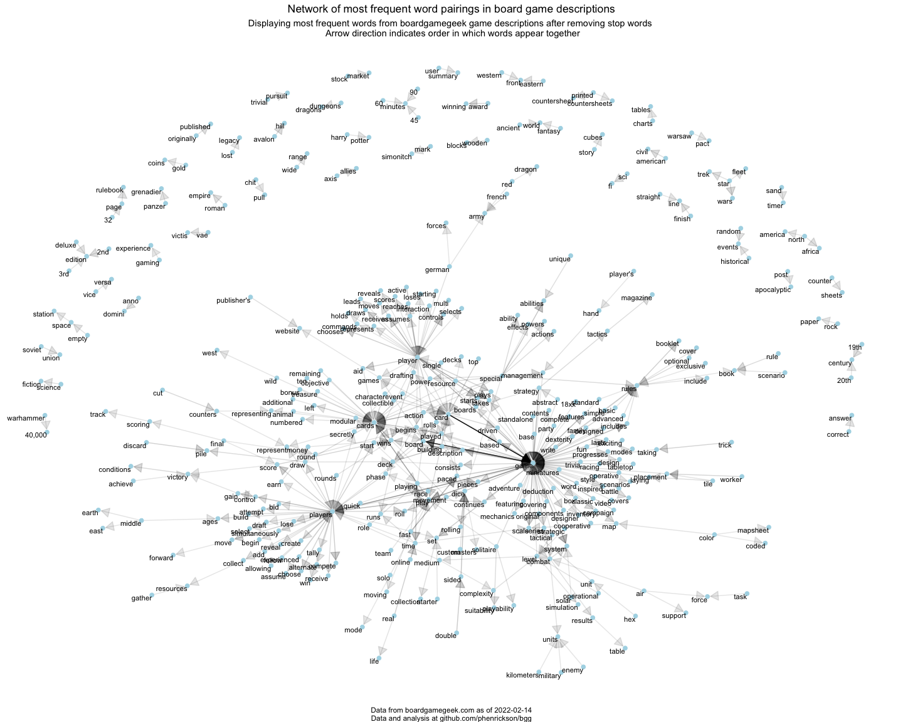<!-- -->

# Correlations Between Words

We can examine the degree of correlation for all word pairings, meaning how frequently they appear next to each other compared to how frequently they are separate. We'll filter to include only words that frequently appear (greater than 200 times) in descriptions, then filter to only those above a specific level of correlation.


We can make a network of word correlations, somewhat similar to the network plot shown above, but this time with no emphasis on direction.

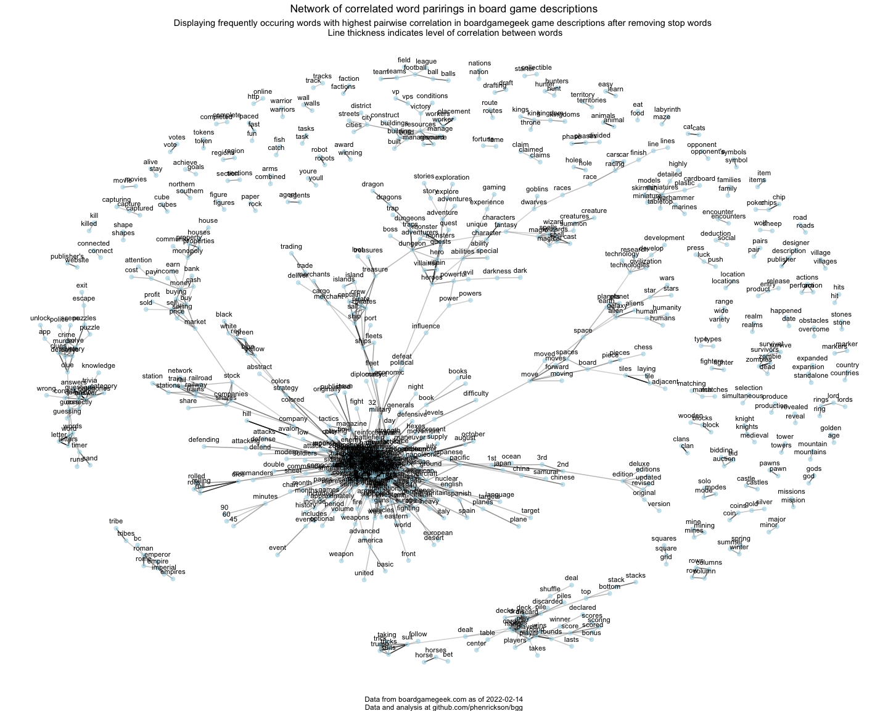<!-- -->

## Individual Words

We can similarly look at the network for specific words. What is correlated with 'worker'?

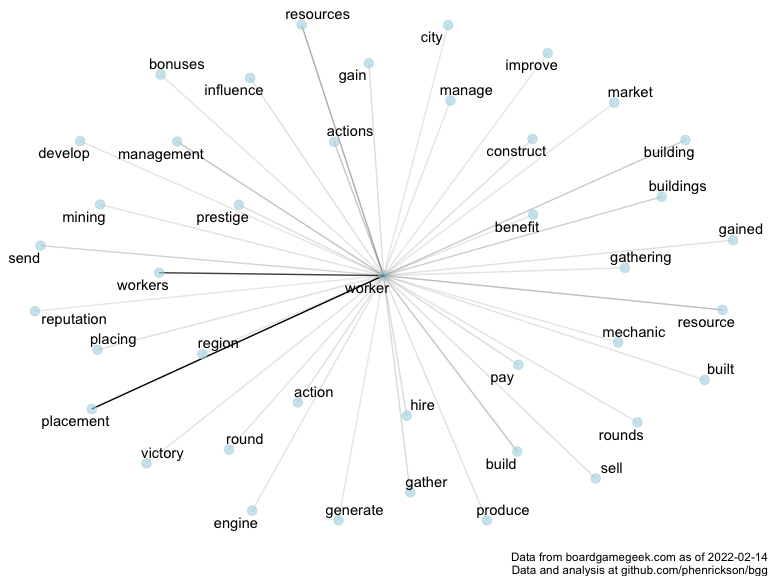<!-- -->

What about 'hero'?

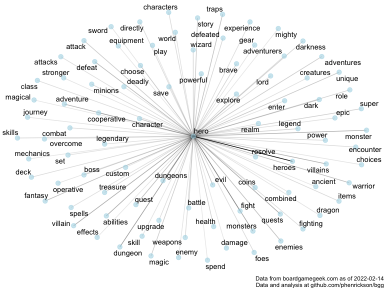<!-- -->

What about railroad?

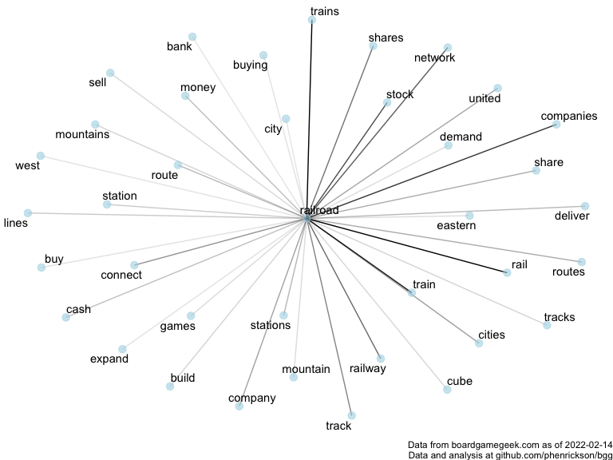<!-- -->

## Publisher/Designer Specific Word Networks

We can also look at games that come from specific publishers and examine their network of words.

### Fantasy Flight

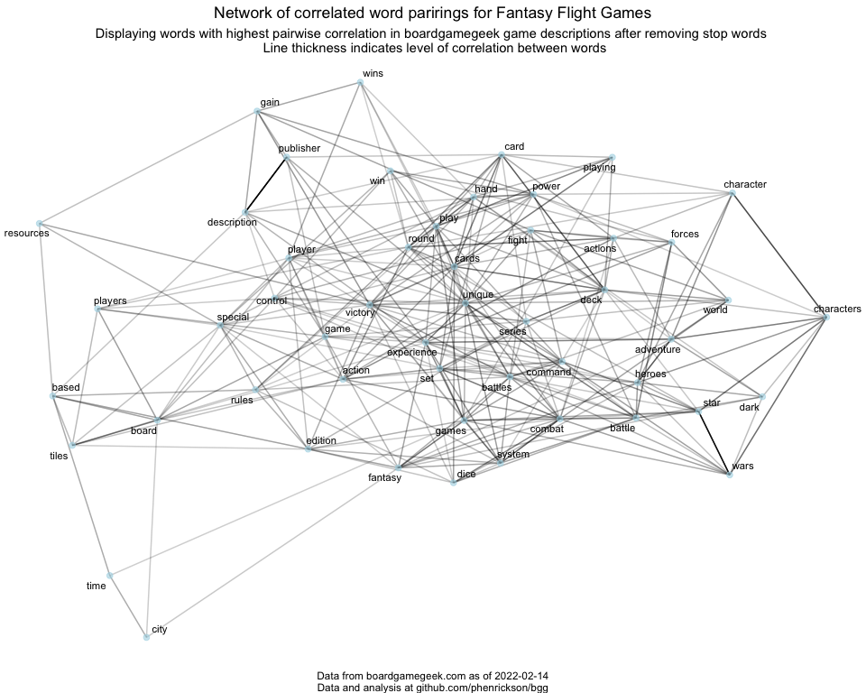<!-- -->

### GMT Games

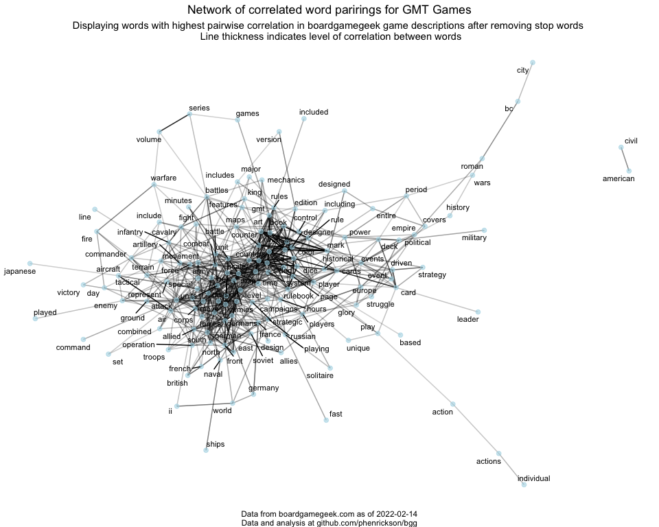<!-- -->

### Rio Grande

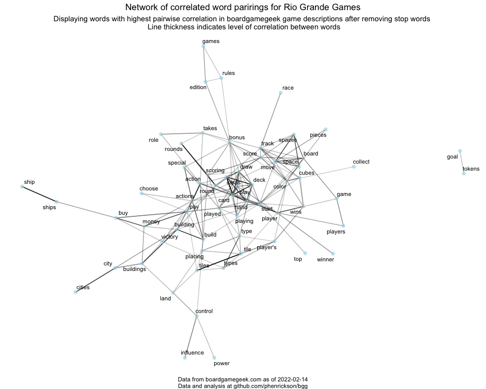<!-- -->

### Reiner Knizia

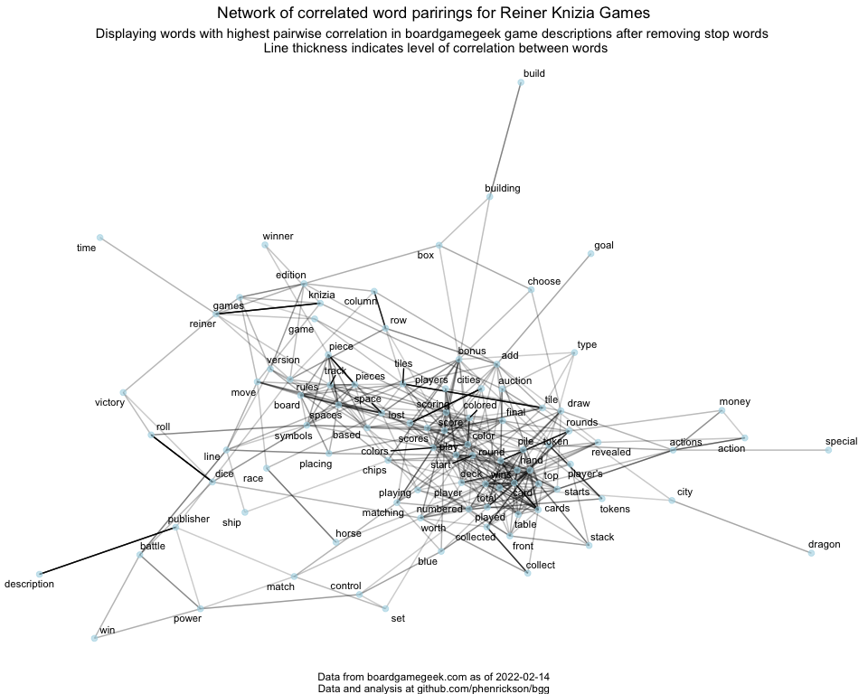<!-- -->

### Uwe Rosenberg

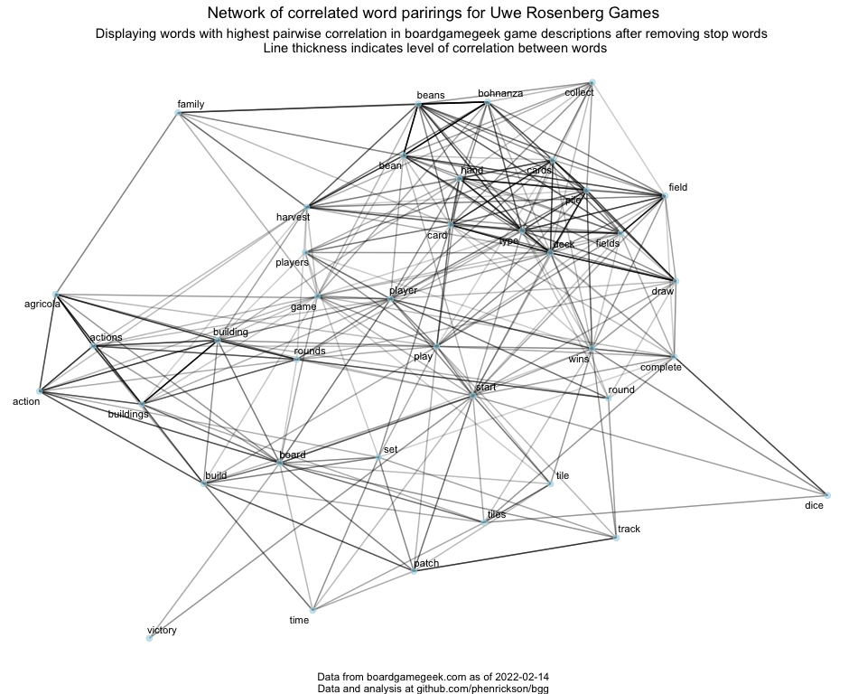<!-- -->

### Corey Konieczka

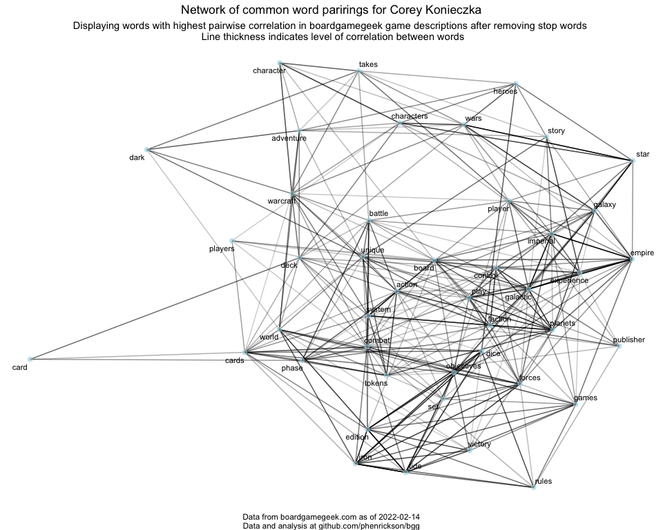<!-- -->

